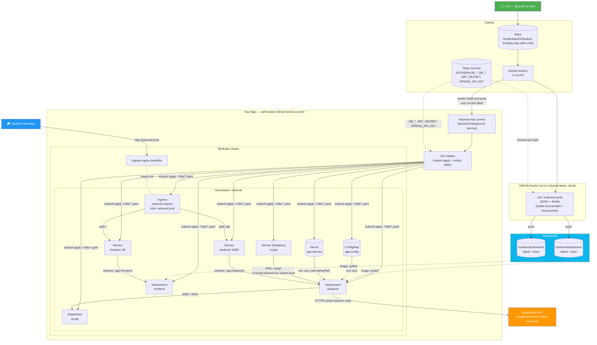
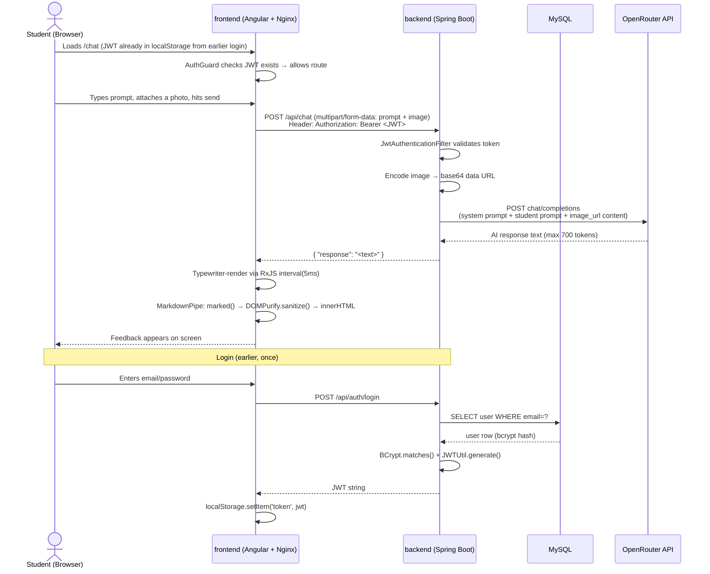
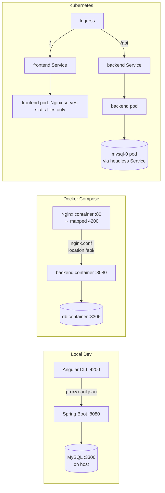
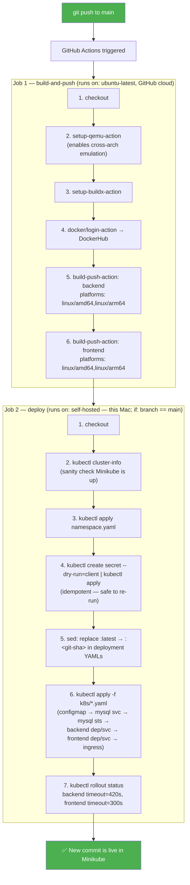
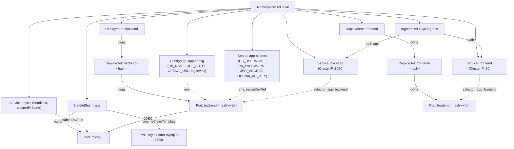
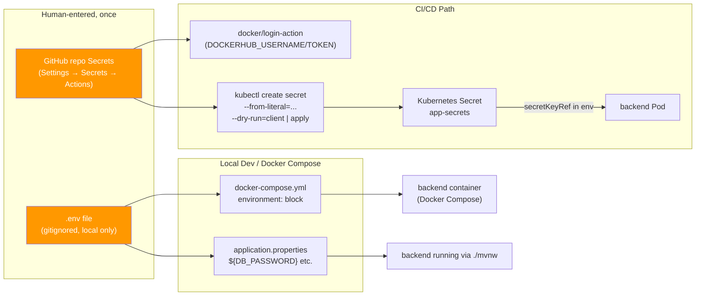

# EduEval — Full System Architecture & Connectivity Map

> A single reference document explaining **what every part of this project is**, **how each piece works**, and **exactly how everything is connected** — from a student's click in the browser, through the backend and database, all the way to how a `git push` turns into a running pod in Kubernetes. Read top to bottom for the full picture, or jump to a section.

---

## Table of Contents

1. [What This Project Is](#1-what-this-project-is)
2. [The Master Diagram — Everything Connected](#2-the-master-diagram--everything-connected)
3. [The Three Services, Explained](#3-the-three-services-explained)
4. [Backend — File-by-File](#4-backend--file-by-file)
5. [Frontend — File-by-File](#5-frontend--file-by-file)
6. [Request Flow — A Student Submits Homework](#6-request-flow--a-student-submits-homework)
7. [The Three Ways to Run This App](#7-the-three-ways-to-run-this-app)
8. [CI/CD Pipeline — From `git push` to a Running Pod](#8-cicd-pipeline--from-git-push-to-a-running-pod)
9. [Kubernetes Object Graph](#9-kubernetes-object-graph)
10. [The Secrets & Environment Variable Journey](#10-the-secrets--environment-variable-journey)
11. [Full File Inventory](#11-full-file-inventory)
12. [Glossary](#12-glossary)

---

## 1. What This Project Is

**EduEval** (working name "EduBot" in the UI) is a full-stack web app that lets students paste a text question and/or upload a photo of their practice work, and get AI-generated formative feedback — estimated rubric scores, hints, corrections — without the AI ever helping on a live exam (that refusal behavior is baked into the system prompt sent to the LLM).

Three independently deployable services, one shared purpose:

| Service | What it does | Built with |
|---|---|---|
| **frontend** | Everything the student sees and clicks | Angular 17 (standalone components), Tailwind CSS, compiled and served by Nginx |
| **backend** | Auth, business logic, and the only thing allowed to talk to the LLM | Spring Boot 3.4.4 / Java, Spring Security + JWT |
| **db** | Stores user accounts | MySQL 8.0 |

Everything downstream of that — Docker, Docker Compose, GitHub Actions, DockerHub, Kubernetes — exists to package, ship, and run those three services reliably. That's what the rest of this document maps out.

---

## 2. The Master Diagram — Everything Connected

This is the whole system in one picture: your laptop, GitHub, DockerHub, and the Kubernetes cluster, and how a code change travels through all of them to become a running pod.



**Read it as three acts:**
1. **Left → middle:** your push triggers GitHub Actions, which builds both Docker images and pushes them to DockerHub.
2. **Middle → right:** because that image needs to land on *your* Minikube cluster (not reachable from GitHub's cloud), the `deploy` job runs on a **self-hosted runner** — this Mac — which already has `kubectl` pointed at Minikube.
3. **Inside the cluster:** ConfigMap/Secret feed environment variables into the backend; the backend talks to MySQL over the cluster's internal DNS; the Ingress is the single door in from a browser, splitting traffic by path.

---

## 3. The Three Services, Explained

### `backend` — Spring Boot API (port 8080)

The only service allowed to hold credentials and talk to the outside world (MySQL, OpenRouter). Responsibilities:
- **Auth**: register/login, issues JWTs, hashes passwords with BCrypt.
- **Authorization**: `JwtAuthenticationFilter` runs on every request except `/api/auth/**`, validating the `Authorization: Bearer <token>` header before any controller logic runs.
- **Chat proxy**: receives a student's prompt (+ optional images), builds an OpenAI-compatible chat completion request with a fixed system prompt ("formative feedback only, refuse exam help"), forwards it to OpenRouter, and returns `{ "response": "<text>" }`.

### `frontend` — Angular SPA (port 4200 locally / 80 in its container)

A standalone-components Angular 17 app. Built once into static files by `ng build`, then served by an Nginx container in production — Angular itself never runs server-side after the build step. Nginx also does one more job depending on environment (see §7): reverse-proxying `/api/*` to the backend when there's no Kubernetes Ingress to do it.

### `db` — MySQL 8.0 (port 3306)

A single `users` table (`id`, `name`, `email`, `password` bcrypt hash, `role` enum `STUDENT`/`TEACHER`), managed by Hibernate (`ddl-auto=update` — no manual migrations). In Docker Compose it's a plain container with a named volume; in Kubernetes it's a `StatefulSet` with its own persistent volume, because unlike the stateless frontend/backend, losing the database pod must not mean losing the data.

---

## 4. Backend — File-by-File

```
backend/src/main/java/com/webapp/backend/
├── BackendApplication.java          # Spring Boot entrypoint (main method)
├── controller/
│   ├── AuthController.java          # POST /api/auth/register, /login  — GET /api/auth/me
│   ├── ChatController.java          # POST /api/chat — builds & sends the OpenRouter request
│   └── UserController.java          # user-related endpoints
├── model/
│   ├── User.java                    # JPA entity — the `users` table
│   └── enumeration/UserRole.java    # STUDENT | TEACHER
├── repository/
│   └── UserRepository.java          # Spring Data JPA — no SQL written by hand
├── service/
│   ├── AuthService.java / UserService.java        # interfaces
│   └── impl/
│       ├── AuthServiceImpl.java
│       ├── UserServiceImpl.java
│       └── CustomUserDetailsService.java  # bridges User entity ↔ Spring Security
├── config/
│   ├── SecurityConfig.java          # HTTP security rules, which paths are public
│   ├── CorsConfig.java              # allows the Angular dev server / frontend origin
│   └── filter/JwtAuthenticationFilter.java  # runs once per request, validates JWT
└── util/
    ├── JWTUtil.java                 # sign/verify tokens using JWT_SECRET
    ├── LoginRequest.java / RegisterRequest.java   # request DTOs
```

**How a request is authorized:** every incoming request passes through `JwtAuthenticationFilter` in Spring's filter chain (registered in `SecurityConfig`). It reads the `Authorization` header, asks `JWTUtil` to validate the signature against `JWT_SECRET`, and — if valid — loads the user via `CustomUserDetailsService` and puts them in the `SecurityContext` so `@AuthenticationPrincipal` works in controllers downstream. Paths under `/api/auth/**` skip this filter (you can't need a token to get one).

---

## 5. Frontend — File-by-File

```
frontend/src/app/
├── app.routes.ts        # /welcome /register /login /chat  (empty path redirects to /welcome)
├── app.config.ts         # Angular app-level providers (HttpClient, router, etc.)
├── components/
│   ├── landing/           # marketing/welcome page
│   ├── login/ register/   # auth forms → call AuthService
│   ├── navbar/            # top nav, shows login state
│   └── chat/              # the actual EduBot chat UI
├── service/
│   ├── auth.service.ts    # login/register HTTP calls, stores JWT in localStorage
│   ├── chat.service.ts    # POSTs multipart/form-data (prompt + images) to /api/chat
│   └── user.service.ts    # user profile calls
├── guard/auth.guard.ts     # blocks /chat if no valid JWT present
├── pipe/markdown.pipe.ts   # renders AI markdown response → sanitized HTML (marked + DOMPurify)
├── interface/user.interface.ts
└── utils/consts.ts         # AUTH_API / CHAT_API / USER_API base paths
```

**The one line that makes this app portable across three environments:** `utils/consts.ts` defines the API paths as **relative**, not absolute:
```ts
export const AUTH_API = '/api/auth'
export const CHAT_API = '/api/chat'
export const USER_API = '/api/users'
```
The Angular app never hardcodes a hostname. Whoever is sitting in front of it at `/api/*` — the local dev proxy, Nginx in Docker Compose, or the Kubernetes Ingress — is free to route it anywhere. See §7 for exactly how each environment fills that role.

**Chat UX detail:** the backend returns the full AI response in one shot, but `ChatComponent` "streams" it to the screen character-by-character using an RxJS `interval(5ms)` for a typewriter effect, then renders it as Markdown via the `MarkdownPipe`.

---

## 6. Request Flow — A Student Submits Homework



Notice: **MySQL is only touched at login/register.** The chat flow itself never hits the database — it's a stateless pass-through from browser → backend → OpenRouter and back.

---

## 7. The Three Ways to Run This App

The same three services, three different "who's in charge of `/api` routing" answers:

| | Local dev (no Docker) | Docker Compose | Kubernetes |
|---|---|---|---|
| Frontend served by | Angular CLI dev server (`ng serve`) | Nginx in a container | Nginx in a container, in a pod |
| Who routes `/api/*` | `proxy.conf.json` (Angular dev proxy) | Nginx's own `location /api/` block, `proxy_pass http://backend:8080` | Kubernetes **Ingress**, routing straight to the `backend` Service — Nginx *inside* the frontend pod never sees `/api` traffic |
| Backend reaches DB via | `localhost:3306` | Docker Compose service DNS `db:3306` | Kubernetes headless-service DNS `mysql-0.mysql.edueval.svc.cluster.local:3306` |
| Config source | `application.properties` reading `.env` directly (`spring.config.import`) | env vars injected by `docker-compose.yml` from `.env` | env vars injected from ConfigMap/Secret in `backend-deployment.yaml` |
| Start command | `cd backend && ./mvnw spring-boot:run` + `cd frontend && npm start` | `docker compose up --build` | `kubectl apply -f k8s/` (or the CI/CD deploy job) |



This is exactly why `consts.ts` (§5) uses relative paths — the frontend code is identical in all three columns; only the infrastructure around it changes who answers `/api`.

---

## 8. CI/CD Pipeline — From `git push` to a Running Pod

Pipeline file: `.github/workflows/ci-cd.yml`. Two jobs.



**Why two different `runs-on` values?** Job 1 needs no special environment — any cloud runner can build a Docker image and push it to a public registry. Job 2 needs to run `kubectl` against a cluster that only exists on *this* Mac's `localhost` — a GitHub-hosted cloud runner physically cannot reach it. That's why this Mac is registered as a **self-hosted runner** (`~/actions-runner`, running as a background `launchd` service so it's always listening for jobs, no terminal needed).

**Why pin `:latest` → `:<sha>` before applying?** If the image tag in the manifest never changes, Kubernetes assumes it already has the right image and won't re-pull it. Rewriting the tag to the unique commit SHA forces a real rolling update every time.

---

## 9. Kubernetes Object Graph

Not every object in `k8s/` is equal — some *own* others, some just *select* others by label. This is the actual ownership/reference graph inside the `edueval` namespace:



**Key distinctions worth understanding:**
- **`Deployment` vs `StatefulSet`** — the backend/frontend are stateless (any replica is interchangeable, so `Deployment` is enough); MySQL needs a stable identity and persistent storage across restarts, so it's a `StatefulSet` with its own `PersistentVolumeClaim`.
- **Deployment → ReplicaSet → Pod** is an *ownership* chain (each level manages the one below it; deleting a Deployment deletes its ReplicaSets and Pods). A `Service` → `Pod` link is *not* ownership — it's a live label selector (`app=backend`), which is why rolling updates work: new pods matching the label are picked up automatically, old ones dropped.
- **`mysql` is a headless Service** (`clusterIP: None`) specifically so it doesn't get a virtual IP and instead gives each pod its own stable DNS name (`mysql-0.mysql.edueval.svc.cluster.local`) — required by `StatefulSet`s.

---

## 10. The Secrets & Environment Variable Journey

Every secret has exactly one place it's typed by a human, and flows outward from there. There is no k8s equivalent of "hardcode it and hope" — see the diagram:



**Why this matters for the assignment:** nothing sensitive is ever committed to git. `.env`, `k8s/secret.yaml` (with real values), `credentials.txt`, and `setup-github-secrets.sh` are all in `.gitignore`. The *shape* of the config (which variables exist) is committed; the *values* never are. GitHub Secrets are encrypted at rest and only decrypted into the runner's environment during a workflow run.

---

## 11. Full File Inventory

| Path | What it is |
|---|---|
| `backend/` | Spring Boot source, Maven wrapper, `application.properties` |
| `frontend/` | Angular source, `angular.json`, `package.json`, `proxy.conf.json` |
| `Dockerfile-backend` | Single-stage build: `eclipse-temurin` JDK → `./mvnw package` → runnable jar |
| `Dockerfile-frontend` | Multi-stage: `node:20` builds Angular → `nginx:alpine` serves the static output |
| `frontend/nginx.conf` | Nginx config baked into the frontend image — proxies `/api` (Compose only) and SPA fallback routing |
| `docker-compose.yml` | Orchestrates `backend` + `frontend` + `db` on one bridge network for local dev |
| `.env` | Real secret values for local/Compose runs *(gitignored)* |
| `.github/workflows/ci-cd.yml` | The CI/CD pipeline described in §8 |
| `k8s/namespace.yaml` | Creates the `edueval` namespace |
| `k8s/configmap.yaml` | Non-sensitive config (`app-config`) |
| `k8s/secret.yaml` | Template for sensitive config (`app-secrets`) — real values only applied via CI or manually, file itself is gitignored |
| `k8s/mysql-statefulset.yaml` / `mysql-service.yaml` | The database in Kubernetes |
| `k8s/backend-deployment.yaml` / `backend-service.yaml` | The API in Kubernetes |
| `k8s/frontend-deployment.yaml` / `frontend-service.yaml` | The SPA in Kubernetes |
| `k8s/ingress.yaml` | Single entry point, path-based routing |
| `setup-github-secrets.sh` | Local helper script to push `.env` values as GitHub Secrets *(gitignored)* |
| `~/actions-runner/` | The self-hosted GitHub Actions runner installation (outside the repo, on this Mac) |
| `DEVOPS_DOCUMENTATION.md` | Prose walkthrough of every decision, plus a real troubleshooting log with evidence |
| `ARCHITECTURE.md` | *(this file)* — the connectivity map |

---

## 12. Glossary

| Term | Plain-English meaning |
|---|---|
| **Pod** | The smallest deployable unit in Kubernetes — one or more containers that always run together on the same node, sharing network/storage. In this project: one container per pod. |
| **Deployment** | A controller that keeps N replicas of a Pod template running, and manages rolling updates. Used for the stateless backend/frontend. |
| **StatefulSet** | Like a Deployment, but for workloads that need a stable identity and persistent storage per replica — used for MySQL. |
| **ReplicaSet** | The layer between a Deployment and its Pods; ensures the desired replica count exists. You rarely touch these directly — Deployments manage them. |
| **Service** | A stable network endpoint (virtual IP + DNS name) in front of a changing set of Pods, found via a label selector. |
| **Headless Service** | A Service with no virtual IP (`clusterIP: None`) — instead gives each backing Pod its own DNS name. Required for StatefulSets. |
| **Ingress** | The single HTTP(S) entry point into the cluster from outside, routing by hostname/path to internal Services. Requires an Ingress *controller* (here: `ingress-nginx`) to actually do the routing. |
| **ConfigMap / Secret** | Key-value stores injected into Pods as environment variables or files. Secrets are base64-encoded (not encrypted by default) and meant for sensitive values; ConfigMaps for everything else. |
| **Namespace** | A logical partition inside one cluster — lets `edueval`'s resources coexist with `kube-system`, `ingress-nginx`, etc. without name collisions. |
| **Self-hosted runner** | A machine you register with GitHub Actions to execute workflow jobs, instead of GitHub's own cloud VMs — necessary here because the job needs to reach `localhost`-only infrastructure (Minikube). |
| **Multi-arch image** | A single image tag that actually points to multiple platform-specific builds (e.g. `linux/amd64` + `linux/arm64`); the container runtime automatically pulls the one matching its own CPU architecture. |
| **JWT (JSON Web Token)** | A signed, self-contained token proving who a user is, without the server needing to look anything up — the signature is checked against `JWT_SECRET` on every request. |
