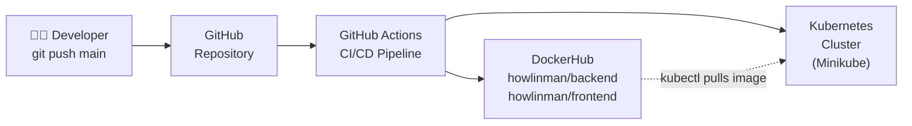
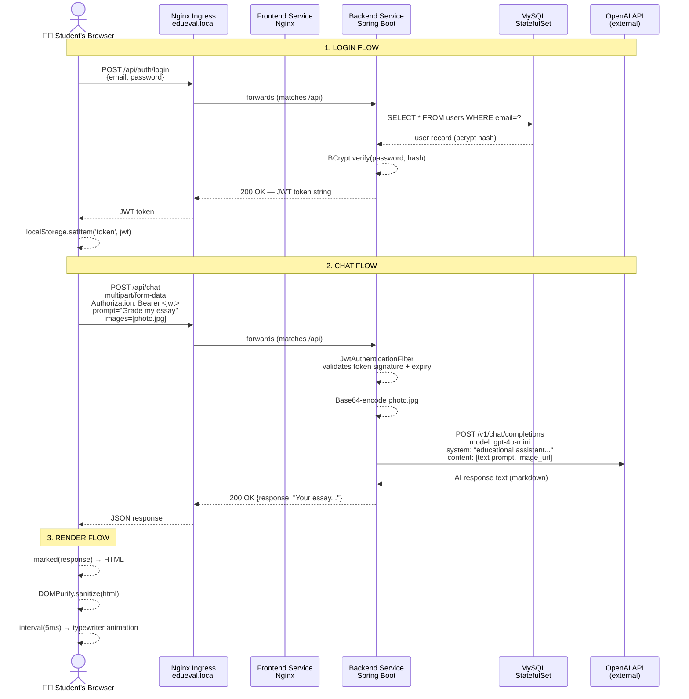

# DevOps Documentation — Student Grading App with LLMs

> **EduEval** is a full-stack web application that lets students get AI-powered formative feedback on their work. This document explains every DevOps decision: how the app is containerised, how the three services talk to each other, how code automatically travels from a developer's laptop all the way to a running Kubernetes cluster, and why each piece was designed the way it was.

---

## Table of Contents

1. [System Overview](#1-system-overview)
2. [Containerisation — Dockerfiles](#2-containerisation--dockerfiles)
3. [Local Orchestration — Docker Compose](#3-local-orchestration--docker-compose)
4. [CI/CD Pipeline — GitHub Actions](#4-cicd-pipeline--github-actions)
5. [Kubernetes — Core Concepts](#5-kubernetes--core-concepts)
6. [Kubernetes Manifests — In Detail](#6-kubernetes-manifests--in-detail)
7. [End-to-End Request Flow](#7-end-to-end-request-flow)
8. [Environment Variable Journey](#8-environment-variable-journey)
9. [API Routing — How the Frontend Finds the Backend](#9-api-routing--how-the-frontend-finds-the-backend)
10. [Security Considerations](#10-security-considerations)
11. [Deployment Cheat Sheet](#11-deployment-cheat-sheet)

---

## 1. System Overview

The application is made of three services that must run together:

| Service | Technology | Responsibility |
|---------|-----------|---------------|
| **frontend** | Angular 17 + Nginx | Serves the web UI to the browser |
| **backend** | Spring Boot 3 / Java 17 | REST API, JWT auth, calls OpenAI |
| **db** | MySQL 8.0 | Persists user accounts |

```
┌─────────────────────────────────────────────────────────────────┐
│                        DEVELOPER'S BROWSER                       │
│                                                                   │
│   http://edueval.local/           http://edueval.local/api/      │
└──────────────────┬───────────────────────────┬──────────────────┘
                   │                           │
                   ▼                           ▼
┌──────────────────────────────────────────────────────────────────┐
│                     KUBERNETES CLUSTER (Minikube)                 │
│                                                                   │
│  ┌─────────────────────────────────────────────────────────────┐ │
│  │                   Namespace: edueval                         │ │
│  │                                                              │ │
│  │  ┌──────────────┐    ┌──────────────┐   ┌───────────────┐  │ │
│  │  │   Ingress     │    │   frontend   │   │    backend    │  │ │
│  │  │ edueval.local │───▶│   (Nginx)    │   │ (Spring Boot) │  │ │
│  │  │               │    │   port 80    │   │   port 8080   │  │ │
│  │  │  /api ──────────────────────────▶│   │               │  │ │
│  │  │  /   ──────▶  │    └──────────────┘   └───────┬───────┘  │ │
│  │  └──────────────┘                                │           │ │
│  │                                                  ▼           │ │
│  │                                         ┌───────────────┐   │ │
│  │                                         │     MySQL     │   │ │
│  │                                         │  StatefulSet  │   │ │
│  │                                         │   port 3306   │   │ │
│  │                                         └───────────────┘   │ │
│  │                                                              │ │
│  │  ┌─────────────┐  ┌──────────────┐                          │ │
│  │  │  ConfigMap  │  │    Secret    │  ← injected as env vars  │ │
│  │  │ app-config  │  │  app-secrets │    into every container  │ │
│  │  └─────────────┘  └──────────────┘                          │ │
│  └──────────────────────────────────────────────────────────────┘ │
└──────────────────────────────────────────────────────────────────┘
                                  │
                                  │ backend makes outbound call
                                  ▼
                        ┌─────────────────┐
                        │   OpenAI API    │
                        │  (gpt-4o-mini)  │
                        └─────────────────┘
```

### How code reaches production



---

## 2. Containerisation — Dockerfiles

Containerisation means packaging the application together with everything it needs to run (the JVM, Nginx, compiled code) into a single portable image. Anyone with Docker can then run the exact same image — no "works on my machine" problems.

### 2.1 Backend — `Dockerfile-backend`

```dockerfile
FROM openjdk:21-jdk-slim          # base image — Linux + JDK 21

WORKDIR /app                       # all following commands run from /app
COPY backend/ .                    # copy the entire backend folder into /app

RUN ./mvnw package -DskipTests    # compile the Java code and package into a JAR
                                   # -DskipTests: we don't run tests in Docker builds
                                   # (tests run separately in the CI pipeline)

COPY backend/target/backend-0.0.1-SNAPSHOT.jar app.jar

EXPOSE 8080                        # document that the app listens on 8080
CMD ["java", "-jar", "target/backend-0.0.1-SNAPSHOT.jar"]
```

**Key decisions:**

| Decision | Reason |
|----------|--------|
| `openjdk:21-jdk-slim` | Slim variant is ~300 MB smaller than full JDK; `slim` removes documentation and some tools |
| `-DskipTests` | Integration tests need a running database — running them in the image build step would fail because there is no MySQL container at build time |
| `EXPOSE 8080` | This is documentation only; it does not actually publish the port. The port mapping is done in Docker Compose or Kubernetes |

**Why a JAR and not a WAR?** Spring Boot embeds its own Tomcat web server inside the JAR, so we don't need a separate app server like a traditional WAR deployment.

---

### 2.2 Frontend — `Dockerfile-frontend`

```dockerfile
# ── Stage 1: Build ──────────────────────────────────────────────
FROM node:20 AS builder            # Node.js is only needed to compile the app

WORKDIR /app
COPY frontend/package*.json ./     # copy dependency manifests first
RUN npm install                    # install dependencies (cached layer if unchanged)
COPY frontend/ .                   # copy source code
RUN npm run build                  # compile TypeScript → JavaScript bundle

# ── Stage 2: Serve ──────────────────────────────────────────────
FROM nginx:alpine                  # tiny Linux + Nginx (~25 MB total)

COPY --from=builder /app/dist/frontend/browser /usr/share/nginx/html
COPY frontend/nginx.conf /etc/nginx/conf.d/default.conf

EXPOSE 80
CMD ["nginx", "-g", "daemon off;"]
```

**This is called a multi-stage build** — one of Docker's most important patterns.

```
┌─────────────────────────────────────────┐
│ Stage 1 — Builder (~1.2 GB)             │
│                                          │
│  node:20 + npm + TypeScript compiler    │
│  + 400 MB node_modules                  │
│  → compiles to: dist/frontend/browser/  │
│     (plain HTML + JS + CSS, ~2 MB)      │
└──────────────────┬──────────────────────┘
                   │  COPY only the 2 MB output
                   ▼
┌─────────────────────────────────────────┐
│ Stage 2 — Final image (~27 MB)          │
│                                          │
│  nginx:alpine                            │
│  + compiled Angular app                  │
│  + nginx.conf                            │
│                                          │
│  Node.js and node_modules are GONE       │
└─────────────────────────────────────────┘
```

**Why does this matter?** A 1.2 GB image would take 3+ minutes to pull from DockerHub on every deployment. A 27 MB image pulls in seconds and has a much smaller attack surface (fewer binaries = fewer vulnerabilities).

**Why `dist/frontend/browser/`?** Angular 17 uses the new `application` builder (`@angular-devkit/build-angular:application`). Unlike older builders, it separates browser code from server-side rendering code into a `browser/` subdirectory. The Dockerfile must copy from that path specifically — otherwise Nginx would serve an empty directory.

---

### 2.3 `frontend/nginx.conf` — The Nginx Configuration

```nginx
server {
    listen 80;
    root /usr/share/nginx/html;
    index index.html;

    # Proxy API calls to the backend (active in Docker Compose)
    location /api/ {
        proxy_pass http://backend:8080/api/;
        proxy_http_version 1.1;
        proxy_set_header Host              $host;
        proxy_set_header X-Real-IP         $remote_addr;
        proxy_set_header X-Forwarded-For   $proxy_add_x_forwarded_for;
        proxy_read_timeout 120s;
    }

    # Angular SPA — fall back to index.html for all client-side routes
    location / {
        try_files $uri $uri/ /index.html;
    }
}
```

**Why `try_files $uri $uri/ /index.html`?**

Angular is a Single Page Application. There is only one real HTML file (`index.html`). When a user navigates directly to `http://localhost/chat`, Nginx has no file called `chat` — it would return 404. The `try_files` directive tells Nginx: "look for the file, then look for a folder, and if neither exists, serve `index.html` and let Angular's router handle the URL".

**Why `proxy_pass http://backend:8080/api/`?**

In Docker Compose, all three containers share a network called `app-network`. Within that network, each container is reachable by its **service name** as a hostname. So `backend` resolves to the backend container's IP. When the browser calls `/api/chat`, Nginx forwards the request to `http://backend:8080/api/chat`.

In Kubernetes, this proxy_pass is never triggered because the Ingress controller intercepts `/api` paths before they reach the frontend Nginx.

---

## 3. Local Orchestration — Docker Compose

Docker Compose is the tool for running multiple containers together on a **single machine**. It replaces having to type four or five `docker run` commands with different ports and networks — you define everything in one YAML file.

### `docker-compose.yml` — Explained

```yaml
version: '3.8'

services:

  backend:
    container_name: backend-container
    build:
      context: .                  # Docker build context = project root
      dockerfile: Dockerfile-backend
    ports:
      - "8080:8080"               # HOST:CONTAINER — exposes backend to localhost:8080
    environment:
      - SPRING_DATASOURCE_URL=jdbc:mysql://db:3306/${DB_NAME}?...
      #                                         ↑
      #   "db" is the service name — Docker DNS resolves it to the db container's IP
      - SPRING_DATASOURCE_USERNAME=${DB_USERNAME}   # values come from .env file
      - SPRING_DATASOURCE_PASSWORD=${DB_PASSWORD}
      - OPENAI_API_KEY=${OPENAI_API_KEY}
      - OPENAI_URL=${OPENAI_URL}
      - JWT_SECRET=${JWT_SECRET}
    depends_on:
      db:
        condition: service_healthy   # wait until MySQL passes its health check
    restart: unless-stopped
    networks:
      - app-network

  frontend:
    container_name: frontend
    build:
      context: .
      dockerfile: Dockerfile-frontend
    ports:
      - "4200:80"                 # browser hits localhost:4200, container serves on 80
    depends_on:
      - backend                   # start backend first (no health check — less critical)
    restart: unless-stopped
    networks:
      - app-network

  db:
    container_name: database
    image: mysql:8.0              # pre-built official image, no custom Dockerfile needed
    environment:
      MYSQL_DATABASE: ${DB_NAME}
      MYSQL_ROOT_PASSWORD: ${DB_PASSWORD}
    ports:
      - "3306:3306"
    volumes:
      - db-data:/var/lib/mysql   # named volume — data survives container restarts
    healthcheck:
      test: ["CMD", "mysqladmin", "ping", "-h", "localhost", "-u", "root", "-p${DB_PASSWORD}"]
      interval: 10s
      timeout: 5s
      retries: 5
      start_period: 30s          # give MySQL 30s to initialise before counting failures
    restart: unless-stopped
    networks:
      - app-network

volumes:
  db-data:                       # Docker manages this volume on the host filesystem

networks:
  app-network:
    driver: bridge               # default network type — containers can talk to each other
```

### How the three containers communicate

```
┌──────────────┐     HTTP :8080      ┌──────────────┐
│   frontend   │ ──────────────────▶ │   backend    │
│  (Nginx)     │  proxy_pass /api/   │ (Spring Boot)│
└──────────────┘                     └──────┬───────┘
                                            │
                                            │ JDBC :3306
                                            ▼
                                     ┌──────────────┐
                                     │      db      │
                                     │  (MySQL 8)   │
                                     └──────────────┘

All three containers live on: app-network (Docker bridge)
Docker DNS: "backend" → container IP, "db" → container IP
```

### Why `service_healthy` for the database?

MySQL takes 20–40 seconds to fully initialise on first start (it creates system tables, sets up authentication). If the backend starts before MySQL is ready, Spring Boot's connection pool will fail and the application will crash. The `healthcheck` block defines a command Docker runs periodically. Only once MySQL replies to `mysqladmin ping` does Compose start the backend container.

### The `.env` file

Docker Compose automatically reads a file named `.env` in the same directory. Every `${VARIABLE}` in `docker-compose.yml` is replaced with the value from `.env`. This keeps secrets out of the YAML file that goes into git.

```
DB_NAME=student_db
DB_USERNAME=root
DB_PASSWORD=your-db-password
JWT_SECRET=f4c32b829...
OPENAI_API_KEY=sk-proj-...
OPENAI_URL=https://api.openai.com/v1/chat/completions
```

The `.env` file is listed in `.gitignore` — it is **never committed to the repository**.

---

## 4. CI/CD Pipeline — GitHub Actions

**CI** (Continuous Integration) means: every time code is pushed, automatically verify it builds correctly and package it.

**CD** (Continuous Deployment) means: after a successful build, automatically deploy the new version to the target environment.

The pipeline is defined in `.github/workflows/ci-cd.yml`. GitHub's servers read this file and execute it on every push.

### Pipeline Overview

```mermaid
flowchart TD
    A["👨‍💻 git push to main"] --> B["GitHub Actions triggered"]

    B --> C["Job 1: build-and-push\n🏃 runs-on: ubuntu-latest"]

    C --> C1["1. actions/checkout@v4\n   Download source code"]
    C1 --> C2["2. docker/setup-buildx-action\n   Enable advanced Docker builder"]
    C2 --> C3["3. docker/login-action\n   Authenticate with DockerHub"]
    C3 --> C4["4. Build backend image\n   docker build -f Dockerfile-backend"]
    C4 --> C5["5. Push to DockerHub\n   howlinman/backend:latest\n   howlinman/backend:<sha>"]
    C5 --> C6["6. Build frontend image\n   docker build -f Dockerfile-frontend"]
    C6 --> C7["7. Push to DockerHub\n   howlinman/frontend:latest\n   howlinman/frontend:<sha>"]

    C7 --> D["Job 2: deploy\n🏃 runs-on: ubuntu-latest\n⚠️ needs: build-and-push"]

    D --> D1["1. actions/checkout@v4"]
    D1 --> D2["2. azure/setup-kubectl\n   Install kubectl CLI"]
    D2 --> D3["3. Decode KUBECONFIG_DATA secret\n   Write to ~/.kube/config"]
    D3 --> D4["4. Apply namespace.yaml"]
    D4 --> D5["5. Create Kubernetes Secret\n   from GitHub Secrets"]
    D5 --> D6["6. sed — replace :latest\n   with :<git-sha> in manifests"]
    D6 --> D7["7. kubectl apply\n   all k8s/*.yaml files"]
    D7 --> D8["8. kubectl rollout status\n   Wait for pods to be Ready"]

    style A fill:#4CAF50,color:#fff
    style C fill:#2196F3,color:#fff
    style D fill:#FF9800,color:#fff
    style C5 fill:#0db7ed,color:#fff
    style C7 fill:#0db7ed,color:#fff
    style D8 fill:#4CAF50,color:#fff
```



### When does each job run?

```yaml
on:
  push:
    branches: [main]       # runs on every push to main
  pull_request:
    branches: [main]       # runs on every PR targeting main
```

Pull requests only trigger `build-and-push` (to verify the code compiles). The `deploy` job has an extra condition:

```yaml
if: github.ref == 'refs/heads/main'
```

This prevents PRs from deploying untested code to the cluster.

---

### Step-by-step explanation of every action

#### Step 1 — `actions/checkout@v4`

```yaml
- name: Checkout repository
  uses: actions/checkout@v4
```

GitHub Actions runners start as clean virtual machines. They have no code on them. This step clones the repository so the rest of the steps have access to source files, Dockerfiles, and Kubernetes manifests.

---

#### Step 2 — `docker/setup-buildx-action@v3`

```yaml
- name: Set up Docker Buildx
  uses: docker/setup-buildx-action@v3
```

Docker Buildx is an extended build system. It enables two features used in this pipeline:

- **Layer caching** — Docker images are built in layers. If a layer hasn't changed (e.g., `npm install` when `package.json` is unchanged), Buildx can reuse the cached version from the previous run instead of re-downloading all packages. This turns a 4-minute build into a 30-second build.
- **Multi-platform builds** — can build for `linux/amd64` and `linux/arm64` simultaneously (not used here but enabled).

---

#### Step 3 — `docker/login-action@v3`

```yaml
- name: Log in to DockerHub
  uses: docker/login-action@v3
  with:
    username: ${{ secrets.DOCKERHUB_USERNAME }}
    password: ${{ secrets.DOCKERHUB_TOKEN }}
```

DockerHub requires authentication to push images. The credentials come from **GitHub repository secrets** — encrypted key-value pairs stored in GitHub, never visible in logs.

`DOCKERHUB_TOKEN` is a Personal Access Token (not the account password). Tokens can be scoped to specific permissions (Read/Write/Delete) and revoked individually, which is more secure than using the account password.

---

#### Steps 4 & 5 — Build and push backend image

```yaml
- name: Build and push backend image
  uses: docker/build-push-action@v6
  with:
    context: .                           # build context = project root
    file: Dockerfile-backend             # which Dockerfile to use
    push: ${{ github.ref == 'refs/heads/main' }}  # only push on main branch
    tags: |
      howlinman/backend:latest           # always updated — "give me the newest"
      howlinman/backend:${{ github.sha }} # pinned — "give me this exact commit"
    cache-from: type=gha                 # read cache from GitHub Actions cache
    cache-to: type=gha,mode=max          # write all layers to cache
```

**Why two tags?**

| Tag | Purpose |
|-----|---------|
| `:latest` | Convenience — `docker pull howlinman/backend` always gets the newest version |
| `:<sha>` e.g. `:a3f9b12` | Immutable — once built, this tag never changes. Used during deployment to pin the exact version. Allows rollback: `kubectl set image deployment/backend backend=howlinman/backend:a3f9b12` |

**Why `context: .` (project root)?**

The Dockerfile starts with `COPY backend/ .` — it copies the `backend/` folder from the build context. If the context were `backend/`, there would be no `backend/` subdirectory to copy from. By using the project root as context, both `backend/` and `frontend/` are available to their respective Dockerfiles.

**`cache-from` and `cache-to`:**

GitHub Actions provides a cache storage area. Buildx uploads each Docker layer after a build (`cache-to`), and downloads them before the next build (`cache-from`). On a cache hit, `./mvnw package` (which downloads ~50 MB of Maven dependencies) is skipped entirely.

---

#### Deploy Job — Steps 1 & 2 — Checkout + kubectl

```yaml
- name: Set up kubectl
  uses: azure/setup-kubectl@v4
```

`kubectl` is the command-line tool for talking to Kubernetes clusters. GitHub's ubuntu runners don't have it pre-installed. This action downloads the latest stable `kubectl` binary and adds it to the `PATH`.

---

#### Deploy Job — Step 3 — Configure kubeconfig

```yaml
- name: Configure kubeconfig
  run: |
    mkdir -p ~/.kube
    echo "${{ secrets.KUBECONFIG_DATA }}" | base64 --decode > ~/.kube/config
    chmod 600 ~/.kube/config
```

`kubectl` needs to know:
1. Where is the Kubernetes API server? (hostname and port)
2. What credentials should I use? (certificate or token)

All of this is stored in a file called `kubeconfig`. In Minikube, `~/.kube/config` is created automatically when you run `minikube start`.

To use this from a GitHub Actions runner:
1. On your machine: `kubectl config view --raw | base64` → copy the output
2. Paste it as a GitHub secret named `KUBECONFIG_DATA`
3. In the pipeline: decode it back and write to `~/.kube/config`

`chmod 600` restricts access to the file to the current user only — `kubectl` refuses to use a kubeconfig file that is world-readable.

---

#### Deploy Job — Step 5 — Create Kubernetes Secret idempotently

```yaml
kubectl create secret generic app-secrets \
  --from-literal=DB_USERNAME="${{ secrets.DB_USERNAME }}" \
  --from-literal=DB_PASSWORD="${{ secrets.DB_PASSWORD }}" \
  --from-literal=JWT_SECRET="${{ secrets.JWT_SECRET }}" \
  --from-literal=OPENAI_API_KEY="${{ secrets.OPENAI_API_KEY }}" \
  --namespace=edueval \
  --dry-run=client -o yaml | kubectl apply -f -
```

This is an important pattern — **idempotent secret creation**. Breaking it down:

```
kubectl create secret generic app-secrets ...
```
This would normally fail with `Error: secrets "app-secrets" already exists` on the second run.

```
--dry-run=client -o yaml
```
Instead of actually creating anything, print the YAML that **would** be created.

```
| kubectl apply -f -
```
Pipe that YAML into `kubectl apply`. Apply creates the resource if it doesn't exist, or **updates** it if it does.

The result: the command is safe to run repeatedly. First run creates the secret. Every subsequent run updates it with fresh values from GitHub Secrets.

---

#### Deploy Job — Step 6 — Pin image tags with `sed`

```yaml
sed -i "s|howlinman/backend:latest|howlinman/backend:${{ github.sha }}|g" k8s/backend-deployment.yaml
sed -i "s|howlinman/frontend:latest|howlinman/frontend:${{ github.sha }}|g" k8s/frontend-deployment.yaml
```

The manifest files in the repository say `image: howlinman/backend:latest`. Before applying them to the cluster, `sed` (stream editor) does an in-place string replacement: `latest` → the current commit SHA.

**Why not just keep `:latest` in the manifests?**

If the image tag doesn't change, Kubernetes won't re-pull the image (it assumes it already has it). By changing the tag to the exact SHA, Kubernetes detects the image has changed and pulls the new one, triggering a rolling update.

---

#### Deploy Job — Step 7 — Apply manifests in order

```yaml
kubectl apply -f k8s/configmap.yaml
kubectl apply -f k8s/mysql-service.yaml
kubectl apply -f k8s/mysql-statefulset.yaml
kubectl apply -f k8s/backend-deployment.yaml
kubectl apply -f k8s/backend-service.yaml
kubectl apply -f k8s/frontend-deployment.yaml
kubectl apply -f k8s/frontend-service.yaml
kubectl apply -f k8s/ingress.yaml
```

The order matters:

```
ConfigMap + Secret (already created) → must exist before any Pod reads them
MySQL Service → must exist before StatefulSet so the DNS name is registered
MySQL StatefulSet → creates the Pod with stable name mysql-0
Backend Deployment → reads ConfigMap + Secret; connects to mysql-0.mysql
Backend Service → registers the backend DNS name so Ingress can route to it
Frontend Deployment + Service → same
Ingress → routes external traffic to the two Services
```

`kubectl apply` is **declarative** — it compares what the cluster has with what the YAML describes and makes only the necessary changes. If nothing changed, it says `unchanged`.

---

#### Deploy Job — Step 8 — Wait for rollouts

```yaml
kubectl rollout status deployment/backend  -n edueval --timeout=180s
kubectl rollout status deployment/frontend -n edueval --timeout=60s
```

After applying a Deployment, Kubernetes creates a **new** Pod with the new image and waits for it to become ready before terminating the old one (this is called a **rolling update**). `kubectl rollout status` blocks until the rollout completes. If it fails (e.g., the new image crashes on startup), this step fails, which marks the entire pipeline as failed — alerting the developer before users are affected.

---

## 5. Kubernetes — Core Concepts

Kubernetes is an orchestration platform for running containers at scale. Unlike Docker Compose (single machine), Kubernetes runs containers across a cluster of machines and handles:

- **Self-healing** — if a container crashes, Kubernetes restarts it automatically
- **Rolling updates** — deploy new versions with zero downtime
- **Service discovery** — containers find each other by name, not IP
- **Scaling** — change `replicas: 1` to `replicas: 3` and Kubernetes distributes load

### The Kubernetes object model

Every resource in Kubernetes is an **object** described by a YAML manifest. The manifest has four required fields:

```yaml
apiVersion: apps/v1      # which API group and version handles this object type
kind: Deployment         # what type of object this is
metadata:                # name, namespace, labels
  name: backend
  namespace: edueval
spec:                    # the desired state — what you want, not how to get it
  ...
```

### Namespaces

A Namespace is a logical boundary inside a cluster. Everything in this project lives in the `edueval` namespace. This means:

- `kubectl get pods` won't show them — you must add `-n edueval`
- Other teams' workloads in different namespaces can't accidentally interact with ours
- Resources (CPU, memory) can be limited per namespace with `ResourceQuota`

---

## 6. Kubernetes Manifests — In Detail

### 6.1 `k8s/namespace.yaml`

```yaml
apiVersion: v1
kind: Namespace
metadata:
  name: edueval
  labels:
    app.kubernetes.io/part-of: student-grading-app
```

**Purpose:** Creates the `edueval` namespace. Must be applied first — all other manifests reference it. The label `app.kubernetes.io/part-of` is a Kubernetes convention that marks these resources as belonging to our application (useful for tools that visualise clusters).

---

### 6.2 `k8s/configmap.yaml`

```yaml
apiVersion: v1
kind: ConfigMap
metadata:
  name: app-config
  namespace: edueval
data:
  DB_NAME: student_db
  DDL_AUTO: update
  OPENAI_URL: https://api.openai.com/v1/chat/completions
  LOG_LEVEL_SPRING_SECURITY: INFO
  LOG_LEVEL_APP: INFO
```

**Purpose:** Stores non-sensitive configuration as key-value pairs. Containers mount these as environment variables.

**Why separate from the app image?** A core principle of cloud-native apps (the 12-Factor App methodology) says configuration should be separate from code. Without ConfigMaps, you would need to rebuild the Docker image every time you change a log level or a database name. With a ConfigMap, you update the YAML and do `kubectl apply` — the Pod picks up the new values on its next restart.

**Why not put secrets here?** ConfigMaps are stored as plain text in etcd (Kubernetes' database). Anyone who can read ConfigMaps in the namespace can see the values. Secrets use a different storage path and can be encrypted at rest.

---

### 6.3 `k8s/secret.yaml`

```yaml
apiVersion: v1
kind: Secret
metadata:
  name: app-secrets
  namespace: edueval
type: Opaque
stringData:
  DB_USERNAME: root
  DB_PASSWORD: "your-db-password"
  JWT_SECRET: f4c32b829...
  OPENAI_API_KEY: sk-proj-...
```

**Purpose:** Stores sensitive values. Kubernetes base64-encodes the values when storing them (note: this is encoding, not encryption — it prevents accidental exposure in logs but is not a security measure by itself).

**Why `stringData` instead of `data`?** With `data`, you must provide pre-base64-encoded values. With `stringData`, you write plain text and Kubernetes encodes it for you. Much easier to read and write.

**This file is in `.gitignore`** — it is never committed to the repository. In the CI/CD pipeline, the secret is created directly from GitHub Secrets using `kubectl create secret`.

---

### 6.4 `k8s/mysql-service.yaml` — The Headless Service

```yaml
apiVersion: v1
kind: Service
metadata:
  name: mysql
  namespace: edueval
spec:
  clusterIP: None        # this makes it "headless"
  selector:
    app: mysql
  ports:
    - name: mysql
      port: 3306
      targetPort: 3306
```

**Purpose:** Provides stable DNS for the MySQL StatefulSet pods.

**What is a headless service?** A normal Service gets a virtual IP (ClusterIP) that load-balances traffic across matching pods. A headless service (clusterIP: None) skips the virtual IP — instead, DNS lookups return the actual Pod IPs directly.

**Why does the StatefulSet need this?** StatefulSets require a headless service to give each pod a **stable, predictable DNS name**:

```
mysql-0.mysql.edueval.svc.cluster.local → IP of the mysql-0 pod
```

This is the exact address the backend uses in its JDBC URL. If MySQL were a Deployment (stateless), its pods would get random names like `mysql-7d9f8b6c4-xkp2q` which change on restart. The StatefulSet + headless service guarantees the name `mysql-0` never changes.

---

### 6.5 `k8s/mysql-statefulset.yaml`

```yaml
apiVersion: apps/v1
kind: StatefulSet
metadata:
  name: mysql
  namespace: edueval
spec:
  serviceName: mysql         # must match the headless Service name
  replicas: 1
  selector:
    matchLabels:
      app: mysql
  template:
    spec:
      containers:
        - name: mysql
          image: mysql:8.0
          env:
            - name: MYSQL_ROOT_PASSWORD
              valueFrom:
                secretKeyRef:
                  name: app-secrets
                  key: DB_PASSWORD
            - name: MYSQL_DATABASE
              valueFrom:
                configMapKeyRef:
                  name: app-config
                  key: DB_NAME
          volumeMounts:
            - name: mysql-data
              mountPath: /var/lib/mysql   # MySQL stores its data files here
          readinessProbe:
            tcpSocket:
              port: 3306
            initialDelaySeconds: 30       # wait 30s before first check
            periodSeconds: 10             # check every 10s
            failureThreshold: 6           # fail after 6 consecutive failures (60s)
  volumeClaimTemplates:
    - metadata:
        name: mysql-data
      spec:
        accessModes: [ReadWriteOnce]      # one pod can read/write at a time
        resources:
          requests:
            storage: 2Gi
```

**Why StatefulSet and not Deployment?**

| Feature | Deployment | StatefulSet |
|---------|-----------|-------------|
| Pod names | Random hash (`mysql-7d9f8-xkp2`) | Sequential, stable (`mysql-0`) |
| Storage | Shared or ephemeral | Each pod gets its own PVC |
| Scaling order | Any pod can start/stop first | Pods start 0→1→2, stop 2→1→0 |
| Use case | Stateless apps (web servers, APIs) | Stateful apps (databases) |

MySQL is stateful — it stores data on disk. If the pod restarts, it must reconnect to the **same** disk with the same data. The `volumeClaimTemplates` section automatically creates a PersistentVolumeClaim for each pod:

```
mysql-0 → PVC: mysql-data-mysql-0 → 2 Gi disk on the Minikube node
```

**readinessProbe:** Kubernetes continuously checks if the pod is ready to receive traffic. During MySQL startup (~30 seconds), the pod is not ready. Traffic is not sent to it. The `tcpSocket` probe simply tries to open a connection on port 3306 — if it succeeds, MySQL is listening and ready.

**Env vars from Secret and ConfigMap:**

```yaml
env:
  - name: MYSQL_ROOT_PASSWORD       # MySQL-specific env var
    valueFrom:
      secretKeyRef:                  # read from the Secret object
        name: app-secrets
        key: DB_PASSWORD             # use the value at key "DB_PASSWORD"
```

The `MYSQL_ROOT_PASSWORD` is an env var that the official MySQL image reads on first startup to set the root password. It comes from our Secret, not hard-coded.

---

### 6.6 `k8s/backend-deployment.yaml`

```yaml
apiVersion: apps/v1
kind: Deployment
metadata:
  name: backend
  namespace: edueval
spec:
  replicas: 1
  selector:
    matchLabels:
      app: backend
  template:
    spec:
      containers:
        - name: backend
          image: howlinman/backend:latest   # replaced with :sha by CI/CD pipeline
          ports:
            - containerPort: 8080
          env:
            - name: SPRING_DATASOURCE_URL
              value: "jdbc:mysql://mysql-0.mysql.edueval.svc.cluster.local:3306/student_db?..."
```

**Purpose:** Runs the Spring Boot API. A Deployment manages one or more identical pods. If a pod crashes, Kubernetes automatically creates a replacement.

**Why Deployment (not StatefulSet)?** The backend is stateless — each request carries a JWT token with all the information needed. Any pod can handle any request. No persistent disk is needed (the database is separate). Stateless = Deployment.

**The JDBC URL explained:**

```
jdbc:mysql://mysql-0.mysql.edueval.svc.cluster.local:3306/student_db
            │       │     │              │
            │       │     │              └── Kubernetes cluster DNS suffix
            │       │     └── namespace
            │       └── Service name (the headless service)
            └── Pod name (mysql-0, guaranteed by StatefulSet)
```

This is the full DNS name for the first MySQL pod. It is stable across restarts.

**Spring Boot relaxed binding — how env vars become properties:**

Spring Boot has a feature called "relaxed binding" that converts environment variable names to property names automatically:

```
SPRING_DATASOURCE_URL  →  spring.datasource.url
SPRING_DATASOURCE_PASSWORD →  spring.datasource.password
JWT_SECRET             →  jwt.secret
OPENAI_API_KEY         →  openai.api.key
OPENAI_API_URL         →  openai.api.url
```

Rules: uppercase → lowercase, underscores between words → dots.

**readinessProbe vs livenessProbe:**

```
readinessProbe:                    livenessProbe:
  "Is this pod ready to            "Is this pod still alive
   receive traffic?"                and healthy?"

  initialDelay: 60s                  initialDelay: 90s
  (Spring Boot takes ~45s to start)  (more time for full startup)
  period: 10s                        period: 20s
  
  → Controls whether the pod         → If this fails, Kubernetes
    is added to the Service's          kills and restarts the pod
    load balancer pool
```

**Resource requests and limits:**

```yaml
resources:
  requests:              # guaranteed minimum — Kubernetes reserves this
    memory: 512Mi
    cpu: 250m            # 250 millicores = 0.25 CPU cores
  limits:                # hard maximum — container is killed if it exceeds memory limit
    memory: 1Gi
    cpu: 500m
```

`250m` CPU means the container is guaranteed a quarter of one CPU core. The `m` stands for millicores. 1000m = 1 full core.

---

### 6.7 `k8s/backend-service.yaml`

```yaml
apiVersion: v1
kind: Service
metadata:
  name: backend
  namespace: edueval
spec:
  selector:
    app: backend           # routes to any pod with label app=backend
  ports:
    - name: http
      port: 8080
      targetPort: 8080
```

**Purpose:** Provides a stable virtual IP and DNS name for the backend pods. Without a Service, the Ingress wouldn't know how to find the backend.

**How it works:**

```
Ingress → routes /api traffic to → Service "backend" (ClusterIP)
                                           ↓
                                   kube-proxy load balances
                                           ↓
                              Pod: backend-7f8d9... (port 8080)
```

If the backend were scaled to 3 replicas (`replicas: 3`), the Service would round-robin traffic across all three pods automatically.

**DNS:** Within the cluster, any pod can reach the backend at `backend.edueval.svc.cluster.local:8080` or simply `backend:8080` (short form works within the same namespace).

---

### 6.8 `k8s/frontend-deployment.yaml`

```yaml
apiVersion: apps/v1
kind: Deployment
metadata:
  name: frontend
  namespace: edueval
spec:
  replicas: 1
  template:
    spec:
      containers:
        - name: frontend
          image: howlinman/frontend:latest
          ports:
            - containerPort: 80
          readinessProbe:
            httpGet:
              path: /
              port: 80
            initialDelaySeconds: 10
```

**Purpose:** Runs the Nginx container that serves the compiled Angular application.

The frontend has no environment variables because the Angular app is pre-compiled at build time. All API calls use relative URLs (`/api/chat`, not `http://somehost/api/chat`). The Ingress controller resolves where `/api` goes — the frontend code doesn't need to know.

The `readinessProbe` uses `httpGet` (more thorough than `tcpSocket`) — it actually makes an HTTP request to `/` and checks that Nginx responds with a 2xx or 3xx status.

---

### 6.9 `k8s/frontend-service.yaml`

```yaml
apiVersion: v1
kind: Service
metadata:
  name: frontend
  namespace: edueval
spec:
  selector:
    app: frontend
  ports:
    - name: http
      port: 80
      targetPort: 80
```

**Purpose:** Stable internal endpoint for the frontend pod. The Ingress uses this to route `/` traffic to Nginx.

---

### 6.10 `k8s/ingress.yaml` — The Entry Point

```yaml
apiVersion: networking.k8s.io/v1
kind: Ingress
metadata:
  name: edueval-ingress
  namespace: edueval
  annotations:
    nginx.ingress.kubernetes.io/proxy-read-timeout: "120"
    nginx.ingress.kubernetes.io/proxy-body-size: "10m"
spec:
  ingressClassName: nginx
  rules:
    - host: edueval.local
      http:
        paths:
          - path: /api
            pathType: Prefix
            backend:
              service:
                name: backend
                port:
                  number: 8080
          - path: /
            pathType: Prefix
            backend:
              service:
                name: frontend
                port:
                  number: 80
```

**Purpose:** The Ingress is the single entry point for all external traffic into the cluster. It is a reverse proxy managed by the Nginx Ingress Controller (enabled via `minikube addons enable ingress`).

**Path routing:**

```
Request: GET http://edueval.local/api/chat
                                  ↑
                              matches /api → routed to: backend Service port 8080
                              Spring Boot handles /api/chat

Request: GET http://edueval.local/welcome
                                  ↑
                              matches / → routed to: frontend Service port 80
                              Nginx handles it → serves index.html → Angular router handles /welcome
```

**Why no `rewrite-target` annotation?** Some Ingress configs strip the path prefix when forwarding. For example, `/api/chat` → `/chat`. We do NOT want this — Spring Boot is mapped to `/api/**`, so it needs to receive the full path `/api/chat`. Without `rewrite-target`, the path is forwarded unchanged.

**Annotations explained:**

| Annotation | Value | Purpose |
|-----------|-------|---------|
| `proxy-read-timeout` | `"120"` | OpenAI API calls can take 10–20 seconds. The default Nginx timeout (60s) would close the connection before the AI responds. Set to 120s. |
| `proxy-body-size` | `"10m"` | Students can upload images (JPEGs, PNGs). The default max body size is 1 MB. Set to 10 MB to allow reasonably sized images. |

**`ingressClassName: nginx`** tells Kubernetes which Ingress controller to use. Minikube can have multiple ingress controllers installed simultaneously. This ensures our Ingress is handled by the Nginx controller specifically.

---

## 7. End-to-End Request Flow

### Scenario: Student uploads a photo of their homework and asks for feedback



---

## 8. Environment Variable Journey

The same secret (e.g., the database password) travels through several systems before reaching the running application:

```
Developer's .env file          GitHub Secrets
┌─────────────────┐            ┌─────────────────────────┐
│ DB_PASSWORD=    │            │ DB_PASSWORD (encrypted   │
│ your-db-password│            │ in GitHub's vault)       │
└────────┬────────┘            └───────────┬─────────────┘
         │                                 │
         │ docker-compose reads .env       │ GitHub Actions reads
         │ and injects into containers     │ and injects into pipeline
         ▼                                 ▼
┌─────────────────┐     ┌──────────────────────────────────┐
│ Docker Compose  │     │ CI/CD Pipeline                   │
│ Environment:    │     │ kubectl create secret generic    │
│ MYSQL_ROOT_     │     │  --from-literal=DB_PASSWORD=...  │
│ PASSWORD=       │     └──────────────┬───────────────────┘
│ your-db-password│                    │
└─────────────────┘                    ▼
                          ┌─────────────────────────┐
                          │ Kubernetes Secret        │
                          │ app-secrets              │
                          │ DB_PASSWORD: base64(     │
                          │   your-db-password)      │
                          └───────────┬─────────────┘
                                      │ valueFrom.secretKeyRef
                                      ▼
                          ┌─────────────────────────┐
                          │ Pod Environment Variable  │
                          │ SPRING_DATASOURCE_       │
                          │ PASSWORD=your-db-password│
                          └───────────┬─────────────┘
                                      │ Spring Boot relaxed binding
                                      ▼
                          ┌─────────────────────────┐
                          │ Spring Property           │
                          │ spring.datasource.       │
                          │ password=your-db-password│
                          └─────────────────────────┘
```

---

## 9. API Routing — How the Frontend Finds the Backend

This is one of the most important design decisions in the project. The Angular app needs to call the backend API. The URL to use depends on the environment.

### The solution: relative URLs + environment-specific proxy

`frontend/src/app/utils/consts.ts`:

```typescript
export const AUTH_API = '/api/auth'   // relative — no hostname
export const CHAT_API = '/api/chat'
export const USER_API = '/api/users'
```

When the browser calls `/api/chat`, it sends the request to **the same host it's currently on**. The host then decides where to forward it.

```
┌─────────────────────────────────────────────────────────────┐
│              ENVIRONMENT 1: Local Development               │
│                                                             │
│  Browser → localhost:4200/api/chat                         │
│            ↓                                                │
│  Angular Dev Server (proxy.conf.json)                      │
│  /api → proxy to → http://localhost:8080                   │
│            ↓                                                │
│  Spring Boot :8080/api/chat                                │
└─────────────────────────────────────────────────────────────┘

┌─────────────────────────────────────────────────────────────┐
│              ENVIRONMENT 2: Docker Compose                  │
│                                                             │
│  Browser → localhost:4200/api/chat                         │
│            ↓                                                │
│  Frontend container (Nginx, nginx.conf)                    │
│  location /api/ → proxy_pass http://backend:8080/api/      │
│            ↓                                                │
│  Backend container :8080/api/chat                          │
└─────────────────────────────────────────────────────────────┘

┌─────────────────────────────────────────────────────────────┐
│              ENVIRONMENT 3: Kubernetes                      │
│                                                             │
│  Browser → edueval.local/api/chat                          │
│            ↓                                                │
│  Nginx Ingress Controller                                   │
│  path /api → backend Service :8080                         │
│            ↓                                                │
│  Backend pod :8080/api/chat                                │
│                                                             │
│  (Nginx proxy_pass in frontend is never reached for /api)  │
└─────────────────────────────────────────────────────────────┘
```

### `frontend/proxy.conf.json` (local dev)

```json
{
  "/api": {
    "target": "http://localhost:8080",
    "secure": false,
    "logLevel": "info"
  }
}
```

The Angular CLI dev server reads this file when started with `npm start` (which runs `ng serve --proxy-config proxy.conf.json`). Any request to `/api/**` is forwarded to `http://localhost:8080/api/**`. The browser thinks it's talking to `localhost:4200` — the proxy is invisible.

---

## 10. Security Considerations

| Area | Implementation | Why |
|------|---------------|-----|
| Password storage | BCrypt hashing | One-way hash — even if the database is leaked, passwords can't be reversed |
| Authentication | JWT (JSON Web Tokens) | Stateless — backend doesn't need to store sessions; token carries user info |
| Token expiry | Configured in `JWTUtil` | Prevents tokens stolen from `localStorage` from being used forever |
| API protection | `JwtAuthenticationFilter` | Every request to `/api/**` (except `/api/auth/**`) requires a valid token |
| Credentials in CI/CD | GitHub Secrets | Encrypted at rest, masked in logs, never appear in YAML files |
| `k8s/secret.yaml` | In `.gitignore` | Real credentials never committed to git |
| CORS | `CorsConfig.java` | Restricts which origins can call the API |
| Image uploads | DOMPurify in frontend | AI response rendered as HTML — DOMPurify strips any injected `<script>` tags |
| DockerHub token | PAT (not password) | Can be revoked without changing the account password |

---

## 11. Deployment Cheat Sheet

### First-time setup

```bash
# Start Minikube and enable Ingress
minikube start
minikube addons enable ingress

# Add to /etc/hosts so "edueval.local" resolves to Minikube
echo "$(minikube ip)  edueval.local" | sudo tee -a /etc/hosts

# Set GitHub Actions secrets (after: brew install gh && gh auth login)
bash setup-github-secrets.sh

# Export kubeconfig for CI/CD deploy job
kubectl config view --raw | base64 | \
  gh secret set KUBECONFIG_DATA \
  --repo "HowlinMan24/Student-Grading-App-with-LLMs" --stdin
```

### Manual Kubernetes deployment

```bash
kubectl apply -f k8s/namespace.yaml
kubectl apply -f k8s/configmap.yaml
kubectl apply -f k8s/secret.yaml           # fill in real values first
kubectl apply -f k8s/mysql-service.yaml
kubectl apply -f k8s/mysql-statefulset.yaml
kubectl apply -f k8s/backend-deployment.yaml
kubectl apply -f k8s/backend-service.yaml
kubectl apply -f k8s/frontend-deployment.yaml
kubectl apply -f k8s/frontend-service.yaml
kubectl apply -f k8s/ingress.yaml

# Watch pods start up
kubectl get pods -n edueval -w
```

### Useful debugging commands

```bash
# See all resources in the namespace
kubectl get all -n edueval

# Check pod logs
kubectl logs -n edueval deployment/backend
kubectl logs -n edueval statefulset/mysql

# Describe a pod (shows events, env vars, probe status)
kubectl describe pod -n edueval -l app=backend

# Check Ingress
kubectl get ingress -n edueval

# Shell into a running container
kubectl exec -it -n edueval statefulset/mysql -- mysql -u root -p

# Check the ConfigMap values
kubectl get configmap app-config -n edueval -o yaml

# Manually trigger a rollout (useful to force image re-pull)
kubectl rollout restart deployment/backend -n edueval
```

### Docker Compose (local)

```bash
docker-compose up --build     # build images and start all services
docker-compose down           # stop and remove containers
docker-compose down -v        # also remove the database volume (wipes data)
docker-compose logs backend   # tail backend logs
```

### Local development (no Docker)

```bash
# Backend (requires local MySQL)
cd backend && ./mvnw spring-boot:run

# Frontend (proxies /api to localhost:8080)
cd frontend && npm start
# → http://localhost:4200
```

---

*Generated for the Continuous Integration and Delivery course project.*
*Stack: Angular 17 · Spring Boot 3.4 · MySQL 8 · Docker · GitHub Actions · Kubernetes (Minikube)*
